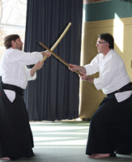

## Ki-Aikido
Unser Verein besteht seit 1994 und wir praktizieren und unterrichten den Stil des Shin-Shin-Toitsu-Aikido - „Aikido in
Einheit von Körper und Geist" oder
auch Ki Aikido, wie es vom japanischen Meister Koichi Tohei entwickelt wurde.

## Yoshigasaki Sensei

Im Jahre 2002 gründete Kenjiro Yoshigasaki (1951-2021), Schüler von Koichi Tohei, seinen eigenen internationalen Dachverband "Ki no Kenkyukai Association Internationale" mit Sitz in Brüssel.

<!--

*Beppe Sensei und Dojoleiter Walter Dervaritsch, 6. Dan*
-->

<figure style="margin-inline-start: 0px;">
  
  <figcaption style="top:2px; font-size:0.9em;">Beppe Sensei und Dojoleiter Walter Dervaritsch, 6. Dan</figcaption>
</figure>

